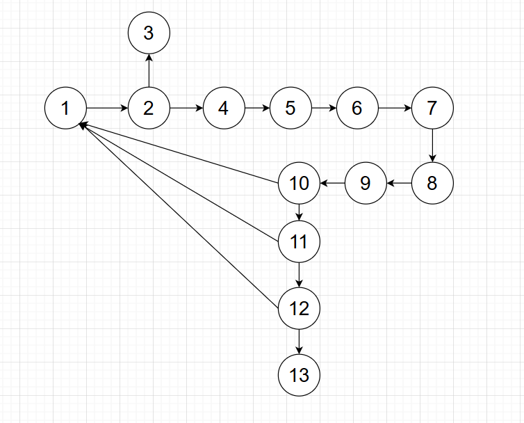

# Multiplicação de Karatsuba

Este projeto implementa o algoritmo de multiplicação de Karatsuba em Python. O método de Karatsuba é um algoritmo eficiente para multiplicação de números inteiros grandes, reduzindo a complexidade em comparação com a multiplicação tradicional. Este projeto foi realizado para a diciplina de Fundamentos de projeto e análise de algoritimos, na PUC MINAS.

## Estrutura

1. main.py

Arquivo com a implementação do método de Karatsuba.

2. Readme.md

Arquivo explicando como o código funciona e como executa-lo.

3. grafo.png

Grafo de fluxo do programa.

## Como o Algoritmo Funciona

O algoritmo de Karatsuba utiliza a seguinte estratégia de divisão e conquista:

1. Divide os números de entrada em duas partes.
2. Realiza três multiplicações recursivas em subproblemas menores.
3. Combina os resultados e obtem o produto final.

## A implementação segue os seguintes passos:

### 1. Caso base
Se um dos números for menor que 10, a multiplicação é feita diretamente:

```python
if x < 10 or y < 10:
    return x * y
```

### 2. Determinação do ponto de divisão
Calculamos o tamanho do maior número e dividimos ao meio:

```python
  z = max(len(str(x)), len(str(y)))
  m = z // 2
```

### 3. Divisão dos números
Os números são separados em duas partes: "primeiros dígitos" e "últimos dígitos".

```python
 x_primeiros = x // 10**m
 x_ultimos = x % 10**m
 y_primeiros = y // 10**m
 y_ultimos = y % 10**m
```

### 4. Recursão
Realizamos três chamadas recursivas para multiplicar partes menores dos números.

```python
  a = karatsuba(x_ultimos, y_ultimos)
  b = karatsuba((x_ultimos + x_primeiros), (y_ultimos + y_primeiros))
  c = karatsuba(x_primeiros, y_primeiros)
```

### 5. Combinação dos resultados
Os produtos são combinados para obter o resultado final.

```python
  return (c * 10**(2*m)) + ((b - c - a) * 10**m) + a
```

## Como Executar o Projeto

1. O projeto foi realizado em Python na versão 3.13.2.
2. Baixe ou clone este repositório.
3. Execute o programa.
4. Insira os números como argumentos de linha de comando e visualize o resultado.

## Análise da Complexidade Ciclomática

A complexidade ciclomática mede a quantidade de caminhos independentes no código e pode ser calculada pela fórmula:

\[ M = E - N + 2P \]

Onde:
- **E** é o número de arestas no grafo de fluxo do código,
- **N** é o número de nós,
- **P** é o número de componentes conexos (para um único programa, **P = 1**).

### Contagem de Nós e Arestas

- **Nós (N) = 13**
  1- Entrada na função
  2- Decisão `if x < 10 or y < 10`
  3- Retorno direto se verdadeiro
  4- Cálculo de `z`
  5- Cálculo de `m`
  6- Separação de `x_primeiros`
  7- Separação de `x_utimos`
  8- Separação de `y_primeiros`
  9- Separação de `y_primeiros`
  10- Cálculo de `a`
  11- Cálculo de `b`
  12- Cálculo de `c`
  13- Retorno da operação matematica final

- **Arestas (E) = 15**
  1- Entrada da função para o if
  2- if para a multiplicação se for verdadeiro
  3- if para calculo de z se for falso
  4- z para calculo de m
  5- m para calculo de x_primeiros
  6- x_primeiros para cálculo de x_ultimos
  7- x_ultimos para cálculo de y_primeiros
  8- y_primeiros para cálculo de y_ultimos
  9- y_últimos para calculo de a
  10- Cálculo de a para a Entrada
  11- Cálculo de a para b
  12- Cálculo de b para Entrada
  13- Cálculo de b para c
  14- Cálculo de c para Entrada
  15- Cálculo de c para retorno da operação matemática final

### Cálculo da Complexidade

\[ M = 15 - 13 + 2(1) \]

\[ M = 4 \]

### Grafo de Fluxo



## Análise da Complexidade Assintótica

O algoritmo de Karatsuba possui complexidade **O(n^{log_2 3})**, pois divide o problema em três subproblemas de tamanho \( n/2 \), diferentemente da multiplicação tradicional.

### Casos de Complexidade:
- **Melhor caso:** **O(1)**: Quando os números possuem apenas um digito.
- **Caso médio:**  **O(n^{log_2 3})**
- **Pior caso:**  **O(n^{log_2 3})**

## Conclusão

O algoritmo de Karatsuba é eficiente para multiplicação de números grandes e tem aplicação em computação de alta precisão. A implementação recursiva reduz significativamente a quantidade de operações em comparação com a multiplicação tradicional.


